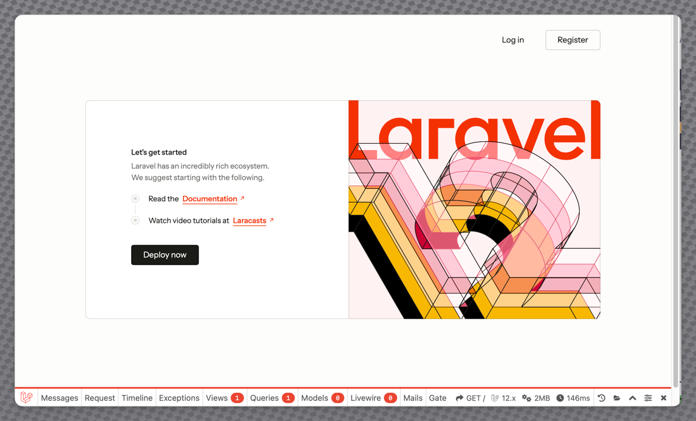

## Install Laravel installer & Update

```shell≈
composer global require laravel/installer
composer global update
```

## Create Application from Scratch

```shell
laravel new l12-base
```

| Step                  | Value    |
|-----------------------|----------|
| Project Name          | l12-base |
| Starter Kit           | None     |
| Test Framework        | Pest     |
| Database (dev)        | SQLite   |
| NPM install and Build | Yes      |

## Add Sanctum, and other Packages

We will add:

- [Laravel Breeze](https://laravel.com/docs/sanctum) (with Sanctum Authentication)
- Laravel Pint (Code Tidy +)
- [Laravel PHP Stan](https://github.com/larastan/larastan) (Static Testing)
- [Laravel Debug Bar](https://laraveldebugbar.com) (Development toolbar)
- [Laravel Livewire](https://livewire.laravel.com) (SPA components in PHP)
- [Laravel Telescope](https://laravel.com/docs/telescope) (Application Monitoring)

Note that with Windows Systems not having the `pcntl` extension for PHP we cannot install Laravel Pail.

For non Windows users, or those using Windows Subsystem for Linux, please feel free to install and use Laravel Pail, a
log streaming package.

---

### Installing Breeze

```shell
cd l12-base

composer require laravel/breeze

php artisan breeze:install
```

| Step      | Value             |
|-----------|-------------------|
| Framework | Blade with Alpine |
| Dark Mode | No                |
| Testing   | Pest              |

#### Remove the postcss.config.js

```shell
rm postconfig.config.js
```

#### Add FontAwesome NPM Package

```shell
npm install @forawesome/fontawesome-free
npm update
```

#### Update any node dependencies

```shell
npm update
```

#### Update the following files:

- vite.config.js
- tailwind.config.js
- resources/css/app.css
- resources/js/app.js

##### vite.config.js

Open the `vite.config.js` file and update the contents to be:

```js
import {defineConfig} from 'vite';
import laravel from 'laravel-vite-plugin';
import tailwindcss from '@tailwindcss/vite';

export default defineConfig({
    plugins: [
        laravel({
            input: ['resources/css/app.css', 'resources/js/app.js'],
            refresh: true,
        }),
        tailwindcss(),
    ]
});
```

##### tailwind.config.js

Open the `tailwind.config.js` file and update the contents to be:

```js
import defaultTheme from 'tailwindcss/defaultTheme';
import forms from '@tailwindcss/forms';

/** @type {import('tailwindcss').Config} */
export default {
    content: [
        './vendor/laravel/framework/src/Illuminate/Pagination/resources/views/*.blade.php',
        './storage/framework/views/*.php',
        './resources/views/**/*.blade.php',
    ],

    theme: {
        extend: {
            fontFamily: {
                sans: ['Figtree', ...defaultTheme.fontFamily.sans],
            },
        },
    },

    plugins: [forms],
};
```

##### resources/css/app.css

Open the `resources/css/app.css` file and update the contents to be:

```css
@import 'tailwindcss';
@import "@fortawesome/fontawesome-free/css/all.css";

@theme {
    --font-sans: 'Instrument Sans', ui-sans-serif, system-ui, sans-serif, 'Apple Color Emoji', 'Segoe UI Emoji',
    'Segoe UI Symbol', 'Noto Color Emoji';
}
```

##### resources/js/app.js

Open the `resources/js/app.js` file and update the contents to be:

```js
import './bootstrap';
```

---

### Install Laravel Pint (Code Tidy +)

Install the composer package for "development mode only":

```shell
composer require laravel/pint --dev
```

---

### Install Laravel Stan (Static Testing)

Install the composer package for "development mode only",
and create new file `phpstan.neon` in the root folder of the project:

```shell
composer require --dev "larastan/larastan"

touch phpstan.neon
```

Edit the `phpstan.neon` (this is a YAML style file) and add:

```neon
includes:
    - vendor/larastan/larastan/extension.neon
    - vendor/nesbot/carbon/extension.neon

parameters:

    paths:
        - app/

    # Level 10 is the highest level
    level: 5

#    ignoreErrors:
#        - '#PHPDoc tag @var#'
#
#    excludePaths:
#        - ./*/*/FileToBeExcluded.php
```

---

### Install Laravel Debug Bar (Development toolbar)

Install the composer package for "development mode only":

```shell
composer require barryvdh/laravel-debugbar --dev
```

---

### Install Laravel Livewire (SPA components in PHP)

Install Livewire and publish its assets:

```shell
composer require livewire/livewire

php artisan vendor:publish --tag=livewire:assets --ansi --force
```

---

### Install Laravel Telescope (Application Monitoring)

```shell
composer require laravel/telescope
php artisan telescope:install
php artisan migrate
```

## Publish Assets (Error messages, pagination et al.)

We will publish a number of assets so that they may be customized as we write our code.

```shell
php artisan vendor:publish --tag=laravel-errors
php artisan vendor:publish --tag=laravel-mail
php artisan vendor:publish --tag=laravel-pagination
php artisan vendor:publish --tag=livewire:pagination
```

### Execute First Static Analysis

Run PHPStan using:

```shell
./vendor/bin/phpstan analyse --memory-limit=2G
```

> ###### Note:
>
> The memory limit of 2GB is needed, the default 128MB is simply not enough for
> analysing Laravel Apps.


Any errors? Fix them at this point.

#### Example PhpStan Output

```text
Note: Using configuration file C:\Users\goulda\Source\Repos\l12-base\phpstan.neon.
 104/104 [============================] 100%

 ------ ---------------------------------------------------------------------------
  Line   app\Http\Controllers\StaticPageController.php
 ------ ---------------------------------------------------------------------------
  22     Method App\Http\Controllers\StaticPageController::about() should return
         Illuminate\View\View but return statement is missing.
  27     Method App\Http\Controllers\StaticPageController::contact() should return
         Illuminate\View\View but return statement is missing.
  32     Method App\Http\Controllers\StaticPageController::privacy() should return
         Illuminate\View\View but return statement is missing.
  37     Method App\Http\Controllers\StaticPageController::terms() should return
         Illuminate\View\View but return statement is missing.
 ------ ---------------------------------------------------------------------------

 [ERROR] Found 4 errors

```


#### Must Verify Email Error

The following is a fix we discovered, **BUT** it is important **NOT** to use this for **EVERY** error
you encounter, as that defeats the purpose of the static analysis:

Open the `app/Http/Controllers/Auth/VerifyEmailController.php` file and locate the lines:

```php
        if ($request->user()->markEmailAsVerified()) {
            event(new Verified($request->user()));
        }
```

Add a single line as shown below:

```php
        if ($request->user()->markEmailAsVerified()) {
        /** @phpstan-ignore-next-line  */
            event(new Verified($request->user()));
        }
```

> ###### Aside:
>
> We may need to see of Taylor and the Laravel crew will look
> at this error and publish a patch.

### Execute First Laravel Pint

Execute Laravel Pint to fix any code structure errors.

This will ensure your code matches the Laravel style.

```shell
./vendor/bin/pint
```

### Add New Environment Variable

Open the `.env` file and between the `APP_URL` and `APP_LOCALE` add the `APP_VERSION` (also update the Locale to `en_AU`
as shown):

```ini
APP_URL = http://localhost:8000

APP_VERSION = "0.0 α"

APP_LOCALE = en_AU
```

## Execute the Development Instance

We can run a development server in a number of different ways.

For this we will use the Terminal and execute the "dev" server script.

Either:
Split the current terminal into 2 halves, or
Open a new terminal instance

Verify you are in the correct folder, if not use the cd command:

> This presumes you are in a folder location such as `Source/Repos`.

```shell
cd l12-base
composer run dev
```

This will execute the dev script that is in the `composer.json` file.

After a few moments, you will be able to open the `http://localhost:8000` location in a
browser and see the default home page:



## Adding Default Users

To make it easier to test the application we will add a "seeder" that will fill the database
with some default users.

This is ideal for the development and testing process.

### Create a User Seeder

Execute:

```shell
php artisan make:seeder UserSeeder
```

Open the newly created `database/seeders/UserSeeder.php` file and update the `run` method to
read:

```php
$seedUsers = [           
    [
        'id' => 99,
        'name' => 'Super Admin',
        'email' => 'supervisor@example.com',
        'password' => 'Password1',
        'email_verified_at' => now(),
        'roles' => ['super-user', 'admin',],
        'permissions' => [],
    ],

    [
        'id' => 100,
        'name' => 'Admin I Strator',
        'email' => 'admin@example.com',
        'password' => 'Password1',
        'email_verified_at' => now(),
        'roles' => ['admin',],
        'permissions' => [],
    ],

    [
        'id' => 200,
        'name' => 'Staff User',
        'email' => 'staff@example.com',
        'password' => 'Password1',
        'email_verified_at' => now(),
        'roles' => ['staff',],
        'permissions' => [],
    ],

    [
        'id' => 300,
        'name' => 'Client User',
        'email' => 'client@example.com',
        'password' => 'Password1',
        'email_verified_at' => now(),
        'roles' => ['client',],
        'permissions' => [],
    ],

    [
        'id' => 301,
        'name' => 'Client User II',
        'email' => 'client2@example.com',
        'password' => 'Password1',
        'email_verified_at' => null,
        'roles' => ['client',],
        'permissions' => [],
    ],

    [
        'id' => 302,
        'name' => 'Client User III',
        'email' => 'client3@example.com',
        'password' => 'Password1',
        'email_verified_at' => null,
        'roles' => ['client',],
        'permissions' => [],
    ],
        ];

foreach ($seedUsers as $newUser) {

    // grab the roles & additional permissions from the seed users
    $roles = $newUser['roles'];
    unset($newUser['roles']);
    
    $permissions = $newUser['permissions'];
    unset($newUser['permissions']);
    
    $user = User::updateOrCreate(
        ['id' => $newUser['id']],
        $newUser
    );
    
    // Uncomment these lines when using Spatie Permissions, to
    // assign the role and additional permissions to the users:
    // $user->assignRole($roles);
    // $user->assignPermissions($permissions);

}

// Uncomment the line below to create (10) randomly named users using the User Factory.
// User::factory(10)->create();
```

To run this seeder only we can use:

```shell
php artisan db:seed UserSeeder
```

To add the seeder to execute when performing a fresh migration and seed use:

Edit the `database/migrations/DatabaseSeeder.php` file, and update the code tobe:

```php
    public function run(): void
    {

        $this->call(
            [
                // When using Spatie Permissions, perform the Role / Permission seeding FIRST
                UserSeeder::class,
                // Add further seeder classes here                
            ]
        );

    }
```

> ### ⚠️ WARNING:
>
> This performs a total database reset and SHOULD NOT be used on production applications.
>
>
> To execute this and reset the database and any logged-in sessions in one go use:
>
> ```shell
> php artisan migrate:fresh --seed
> ```

## Add Static page Controller

We will creat a static page controller that will handle pages that do not perform any
add/edit/delete actions.

Generally, we look at these pages being:

- Home (Welcome)
- Privacy
- License
- About
- Contact Us
- Terms

and so on.

Create the static page controller using:

```shell
php artisan make:controller StaticPageController
```

> ###### Important:
>
> Always name controllers with `Controller` as the last word in the name.

### Add the Static Page Methods to the Controller

Open the new `app/Http/Controllers/StatsicPageController.php` file and add the following
static page methods:

```php
    /**
     * Display site 'Welcome/Index' page
     * 
     * @return View
     */
    public function home(): View
    {
        return view('static.welcome');
    }

    /**
     * Display 'About Us' page
     * 
     * @return View
     */
    public function about(): View
    {
        // return view('static.about');
    }
```

### Edit the Routes

Open the `routes/web.php` file and update it..

Add the required `use` lines:

```php
use App\Http\Controllers\DashboardController;
use App\Http\Controllers\ProfileController;
use App\Http\Controllers\StaticPageController;
use Illuminate\Support\Facades\Route;
```

Update the Home (Welcome) page route

```php

Route::get('/', [StaticPageController::class, 'home'])
    ->name('home');

Route::middleware(['auth', 'verified'])->group(function () {
    Route::get('/dashboard', [DashboardController::class, 'dashboard'])
        ->name('dashboard');
});

Route::middleware('auth')->group(function () {
    Route::get('/profile', [ProfileController::class, 'edit'])->name('profile.edit');
    Route::patch('/profile', [ProfileController::class, 'update'])->name('profile.update');
    Route::delete('/profile', [ProfileController::class, 'destroy'])->name('profile.destroy');
});

require __DIR__ . '/auth.php';
```

## Test USers

For this template, we have the following test users:

| Name            | Username               | Password  | Role        | Verified |
|-----------------|------------------------|-----------|-------------|----------|
| Super Admin     | supervisor@example.com | Password1 | Super-Admin | Y        |
| Admin I Strator | admin@example.com      | Password1 | Admin       | Y        |
| Staff User      | staff@example.com      | Password1 | Staff       | Y        |
| Client User     | client@example.com     | Password1 | Client      | Y        |
| Client User II  | client2@example.com    | Password1 | Client      | N        |
| Client User III | client3@example.com    | Password1 | Client      | N        |

### Create a Dashboard Controller:

```shell
php artisan make DashboardController
```

Edit the new `app/Http/Controllers/DashboardController.php` file, adding the missing lines
from the code below:

```php
class DashboardController extends Controller
{

    public function dashboard(): View
    {
        $user = auth()->user();

        return view('static.dashboard')
            ->with('user', $user);
    }
}

```

We updated the dashboard route in the previous step.

## Admin Page Layout

- Create Admin Layout Component
- Move the view to resource/views/layout and rename to admin.blade.php
- Create an Admin Page Controller
- Create Admin Home page view
- Create Admin Navigation layout view
- Create admin route in routes/web.php

```shell
php artisan make:component AdminLayout

mv resources/views/components/admin-layout.blade.php resources/views/layout/admin.blade.php

phg artisan make:controller Admin/AdminController

mkdir resources/views/admin
touch resources/views/admin/index.blade.php
touch resources/views/layouts/admin-navigation.blade.php
```

#### Admin Page Layout

In the `admin/index.blade.php` file add:

```php
<x-admin-layout>
    <x-slot name="header">
        <h2 class="font-semibold text-xl text-white leading-tight">
            {{ __('Admin Zone') }}
        </h2>
    </x-slot>

    <section class="py-12 mx-12 space-y-4">

        <header>
            <h3 class="text-2xl font-bold text-zinc-700">
                {{__('Statistics')}}
            </h3>
        </header>

        <div class="grid grid-cols-1 sm:grid-cols-2 lg:grid-cols-3 gap-4">
            <article
                class="items-center rounded-lg bg-white shadow hover:shadow-none align-middle hover:bg-zinc-700 transition duration-500 group overflow-hidden border border-zinc-700/75">
                <div class="flex">
                    <header
                        class="w-1/4 bg-zinc-700 text-white  flex items-center justify-center py-6 transition-colors duration-500">
                        <i class="fa-solid fa-laugh-squint text-4xl group-hover:-rotate-45 duration-500 transition-transform"></i>
                    </header>

                    <section class="w-3/4 p-6 flex flex-col justify-center">
                        <p class="text-2xl font-bold text-gray-800 group-hover:text-white mb-1 transition-colors duration-500">
                            1,234
                        </p>

                        <p class="text-gray-600 group-hover:text-white text-sm uppercase tracking-wide transition-colors duration-500">
                            {{ __('Jokes') }}
                        </p>
                    </section>
                </div>
            </article>

            <article
                class="items-center rounded-lg bg-white shadow hover:shadow-none align-middle hover:bg-zinc-700 transition-colors duration-500 group overflow-hidden border border-zinc-700/75">
                <div class="flex">
                    <header
                        class="w-1/4 bg-zinc-700 text-white  flex items-center justify-center py-6 transition-colors duration-500">
                        <i class="fa-solid fa-list-check text-4xl group-hover:-rotate-12 duration-500 transition-transform"></i>
                    </header>

                    <section class="w-3/4 p-6 flex flex-col justify-center">
                        <p class="text-2xl font-bold text-gray-800 group-hover:text-white mb-1 transition-colors duration-500">
                            65
                        </p>

                        <p class="text-gray-600 group-hover:text-white text-sm uppercase tracking-wide transition-colors duration-500">
                            {{ __('Categories') }}
                        </p>
                    </section>
                </div>
            </article>

            <article
                class="items-center rounded-lg bg-white shadow hover:shadow-none align-middle hover:bg-zinc-700 transition-colors duration-500 group overflow-hidden border border-zinc-700/75">
                <div class="flex">
                    <header
                        class="w-1/4 bg-zinc-700 text-white  flex items-center justify-center py-6 transition-colors duration-500">
                        <i class="fa-solid fa-users text-4xl group-hover:-rotate-12 duration-500 transition-transform"></i>
                    </header>

                    <section class="w-3/4 p-6 flex flex-col justify-center">
                        <p class="text-2xl font-bold text-gray-800 group-hover:text-white mb-1 transition-colors duration-500">
                            {{ $userCount }}
                        </p>

                        <p class="text-gray-600 group-hover:text-white text-sm uppercase tracking-wide transition-colors duration-500">
                            {{ __('Users') }}
                        </p>
                    </section>
                </div>
            </article>

            <article
                class="items-center rounded-lg bg-white shadow hover:shadow-none align-middle hover:bg-zinc-700 transition-colors duration-500 group overflow-hidden border border-zinc-700/75">
                <div class="flex">
                    <header
                        class="w-1/4 bg-zinc-700 text-white  flex items-center justify-center py-6 transition-colors duration-500">
                        <i class="fa-solid fa-passport text-4xl group-hover:-rotate-12 duration-500 transition-transform"></i>
                    </header>

                    <section class="w-3/4 p-6 flex flex-col justify-center">
                        <p class="text-2xl font-bold text-gray-800 group-hover:text-white mb-1 transition-colors duration-500">
                            674,865
                        </p>

                        <p class="text-gray-600 group-hover:text-white text-sm uppercase tracking-wide transition-colors duration-500">
                            {{ __('Passengers') }}
                        </p>
                    </section>
                </div>
            </article>

            <article
                class="items-center rounded-lg bg-white shadow hover:shadow-none align-middle hover:bg-zinc-700 transition-colors duration-500 group overflow-hidden border border-zinc-700/75">
                <div class="flex">
                    <header
                        class="w-1/4 bg-zinc-700 text-white  flex items-center justify-center py-6 transition-colors duration-500">
                        <i class="fa-solid fa-user-secret text-4xl group-hover:-rotate-12 duration-500 transition-transform"></i>
                    </header>

                    <section class="w-3/4 p-6 flex flex-col justify-center">
                        <p class="text-2xl font-bold text-gray-800 group-hover:text-white mb-1 transition-colors duration-500">
                            3
                        </p>

                        <p class="text-gray-600 group-hover:text-white text-sm uppercase tracking-wide transition-colors duration-500">
                            {{ __('Roles') }}
                        </p>
                    </section>
                </div>
            </article>

            <article
                class="items-center rounded-lg bg-white shadow hover:shadow-none align-middle hover:bg-zinc-700 transition-colors duration-500 group overflow-hidden border border-zinc-700/75">
                <div class="flex">
                    <header
                        class="w-1/4 bg-zinc-700 text-white  flex items-center justify-center py-6 transition-colors duration-500">
                        <i class="fa-solid fa-earth-asia text-4xl group-hover:-rotate-12 duration-500 transition-transform"></i>
                    </header>

                    <section class="w-3/4 p-6 flex flex-col justify-center">
                        <p class="text-2xl font-bold text-gray-800 group-hover:text-white mb-1 transition-colors duration-500">
                            23,567,890
                        </p>

                        <p class="text-gray-600 group-hover:text-white text-sm uppercase tracking-wide transition-colors duration-500">
                            {{ __('Unique Visitors') }}
                        </p>
                    </section>
                </div>
            </article>

            <article
                class="items-center rounded-lg bg-white shadow hover:shadow-none align-middle hover:bg-zinc-700 transition-colors duration-500 group overflow-hidden border border-zinc-700/75">
                <div class="flex">
                    <header
                        class="w-1/4 bg-zinc-700 text-white  flex items-center justify-center py-6 transition-colors duration-500">
                        <i class="fa-solid fa-universal-access text-4xl group-hover:-rotate-12 duration-500 transition-transform"></i>
                    </header>

                    <section class="w-3/4 p-6 flex flex-col justify-center">
                        <p class="text-2xl font-bold text-gray-800 group-hover:text-white mb-1 transition-colors duration-500">
                            219
                        </p>

                        <p class="text-gray-600 group-hover:text-white text-sm uppercase tracking-wide transition-colors duration-500">
                            {{ __('Logged In') }}
                        </p>
                    </section>
                </div>
            </article>

        </div>
    </section>

    <section class="mx-12 space-y-4">

        <header>
            <h3 class="text-2xl font-bold text-zinc-700">
                {{__('System')}}
            </h3>
        </header>

        <div class="grid grid-cols-1 sm:grid-cols-2 lg:grid-cols-3 gap-4">

            <article
                class="items-center rounded-lg bg-white shadow hover:shadow-none align-middle hover:bg-zinc-700 transition duration-500 group overflow-hidden border border-zinc-700/75">
                <div class="flex">
                    <header
                        class="w-1/4 bg-zinc-700 text-white  flex items-center justify-center py-6 transition-colors duration-500">
                        <i class="fa-solid fa-info-circle text-4xl group-hover:-rotate-12 duration-500 transition-transform"></i>
                    </header>

                    <section class="w-3/4 p-6 flex flex-col justify-center">
                        <p class="text-2xl font-bold text-gray-800 group-hover:text-white mb-1 transition-colors duration-500">
                            {{ env('APP_VERSION')??"development" }}
                        </p>

                        <p class="text-gray-600 group-hover:text-white text-sm uppercase tracking-wide transition-colors duration-500">
                            {{__('Version')}}
                        </p>
                    </section>
                </div>
            </article>

            <p style="background-color:#74fdc5"></p>
            <article
                class="items-center rounded-lg bg-white shadow hover:shadow-none align-middle hover:bg-zinc-700 transition duration-500 group overflow-hidden border border-zinc-700/75">
                <div class="flex">
                    <header
                        class="w-1/4 bg-zinc-700 text-white  flex items-center justify-center py-6 transition-colors duration-500">
                        <i class="fa-solid fa-computer text-4xl group-hover:-rotate-12 duration-500 transition-transform"></i>
                    </header>

                    <section class="w-3/4 p-6 flex flex-col justify-center">
                        <p class="text-2xl font-bold text-gray-800 group-hover:text-white mb-1 transition-colors duration-500">
                            {{ env('APP_ENV')??'Unknown' }}
                        </p>

                        <p class="text-gray-600 group-hover:text-white text-sm uppercase tracking-wide transition-colors duration-500">
                            {{__('Environment')}}
                        </p>
                    </section>
                </div>
            </article>

        </div>

    </section>

</x-admin-layout>


```

#### Admin Navigation Layout

in the `admin/layouts/admin-navigation.blade.php` add:

```php
<div class="flex h-screen flex-col justify-between border-e border-gray-100 bg-white">
    <div class="px-0 py-4">
        <p class="grid h-10 w-full place-content-center text-xs text-gray-600">
            <a class="block" href="{{route('home')}} ">
                <span class="sr-only">Home</span>

                <x-application-logo
                    class="w-14 h-14 fill-current text-gray-700 hover:text-teal-700 transition duration-350"/>
            </a>
        </p>

        <section class="mt-6 space-y-1">

            <x-side-nav-link :href="route('admin.index')" :active="request()->routeIs('admin.*')">
                <i class="fa-solid fa-cog group-hover:text-zinc-500"></i>
                {{ __('Admin Home') }}
            </x-side-nav-link>

            <x-side-nav-link :href="route('dashboard')" :active="request()->routeIs('home')">
                <i class="fa-solid fa-dashboard group-hover:text-zinc-500"></i>
                {{ __('Dashboard') }}
            </x-side-nav-link>

            <details class="group [&_summary::-webkit-details-marker]:hidden">
                <summary
                    class="flex cursor-pointer items-center justify-between px-4 py-2
                           text-gray-500 hover:text-gray-700
                            hover:bg-gray-200
                            transition duration-150"
                >
                        <span class="text-sm font-medium hover:text-zinc-500 transition duration-150">
                            <i class="fa-solid fa-users"></i>
                            {{ __('Users') }}
                        </span>

                    <span class="shrink-0 transition duration-300 group-open:-rotate-180">
                          <i class="fa-solid fa-chevron-down text-sm"></i>
                        </span>
                </summary>

                <section class="mt-2 space-y-1">

                        <x-side-nav-link :href="route('home')" :active="request()->routeIs('home')" class="px-12 py-2">
                            {{ __('Accounts') }}
                        </x-side-nav-link>

                        <x-side-nav-link :href="route('home')" :active="request()->routeIs('home')" class="px-12 py-2">
                            {{ __('Suspended') }}
                        </x-side-nav-link>

                        <x-side-nav-link :href="route('home')" :active="request()->routeIs('home')" class="px-12 py-2">
                            {{ __('Banned Users') }}
                        </x-side-nav-link>

                </section>

            </details>

            <x-side-nav-link :href="route('home')" :active="request()->routeIs('home')">
                <i class="fa-solid fa-laugh group-hover:text-zinc-500"></i>
                {{ __('Jokes') }}
            </x-side-nav-link>

            <x-side-nav-link :href="route('home')" :active="request()->routeIs('home')">
                <i class="fa-solid fa-cat group-hover:text-zinc-500"></i>
                {{ __('Categories') }}
            </x-side-nav-link>

            <details class="group [&_summary::-webkit-details-marker]:hidden">
                <summary
                    class="flex cursor-pointer items-center justify-between px-4 py-2
                         text-gray-500 hover:text-gray-700
                         hover:bg-gray-200
                         transition duration-150"
                >
                        <span class="text-sm font-medium hover:text-zinc-500 transition duration-150">
                            <i class="fa-solid fa-shield"></i>
                            {{ __('Security') }}
                        </span>

                    <span class="shrink-0 transition duration-300 group-open:-rotate-180">
                          <i class="fa-solid fa-chevron-down text-sm"></i>
                        </span>
                </summary>

                <section class="mt-2 space-y-1">
                    <x-side-nav-link :href="route('home')" :active="request()->routeIs('home')" class="px-12 py-2">
                        {{ __('Roles') }}
                    </x-side-nav-link>

                    <x-side-nav-link :href="route('home')" :active="request()->routeIs('home')" class="px-12 py-2">
                        {{ __('Permissions') }}
                    </x-side-nav-link>
                </section>

            </details>

            <x-side-nav-link :href="route('home')" :active="request()->routeIs('home')">
                <i class="fa-solid fa-plane-arrival group-hover:text-zinc-500"></i>
                {{ __('Link X') }}
            </x-side-nav-link>

        </section>
    </div>

    <section class="sticky inset-x-0 bottom-0 border-t border-gray-200">

        <!-- Authentication -->
        <form method="POST" action="{{ route('logout') }}">
            @csrf

            <a
                class="block px-4 py-2 [text-align:_inherit] text-sm font-medium text-gray-500 hover:bg-gray-100 hover:text-gray-700"
                href="{{ route('logout') }}"
                onclick="event.preventDefault();
                                                this.closest('form').submit();">
                <i class="fa-solid fa-sign-out group-hover:text-zinc-500"></i>

                {{ __('Log Out') }}
            </a>
        </form>

        <a href="#" class="flex items-center gap-2 bg-white p-4 hover:bg-gray-50">
            <div
                class="bg-gray-500 text-gray-300 w-10 h-10 rounded-lg flex items-center justify-center font-bold text-md">
                AIM
            </div>

            <div>
                <p class="text-xs">
                    <strong class="block font-medium">Admin Istrator</strong>

                    <span> admin@example.com </span>
                </p>
            </div>
        </a>
    </section>
</div>

```

> #### ℹ️ Remember 
> 
> The repository will always have the most up-to-date version of the template code.

#### Side Nav Link Component

Create a new nav component using:

```shell
touch resources/views/components/side-nav-link.blade.php
```

Add the following:

```php
@props(['active'])

@php
    $classes = ($active ?? false)
                ? 'block px-4 py-2 text-sm font-medium
                   text-gray-500 hover:text-gray-700
                   hover:bg-gray-200
                   focus:border-indigo-700
                   focus:outline-none
                   transition duration-250 ease-in-out'
                : 'block px-4 py-2 text-sm font-medium
                   text-gray-500 hover:text-gray-700 focus:text-gray-700
                   hover:bg-gray-200
                   hover:border-gray-300 focus:border-gray-300
                   focus:outline-none
                   transition duration-250 ease-in-out';
@endphp

<a
    {{ $attributes->merge(['class' => $classes]) }}
>
    {{ $slot }}
</a>

```

Edit the `routes/web.php` file, and find the lines:

```php

Route::middleware('auth')->group(function () {
    Route::get('/profile', [ProfileController::class, 'edit'])->name('profile.edit');
    Route::patch('/profile', [ProfileController::class, 'update'])->name('profile.update');
    Route::delete('/profile', [ProfileController::class, 'destroy'])->name('profile.destroy');
});
```

Immediately BEFORE this, add:

```php
Route::middleware(['auth', 'verified'])
    ->prefix('admin')
    ->name('admin.')
    ->group(function () {
        Route::get('/', [AdminController::class, 'index'])->name('index');
    });
```

### Run Pint

Execute Laravel Pint to tidy code:

```shell
  ./vendor/bin/pint
```

Example of output, actually run on this code:

```text
  ✓........✓.✓.✓..........................✓✓...✓...........

  ───────────────────────────────────────────────────────────────────────── Laravel
    FIXED   ........................................ 57 files, 7 style issues fixed
  ✓ app\Http\Controllers\Admin\AdminController.php method_argument_space, no_unuse…
  ✓ app\Http\Controllers\Auth\VerifyEmailController.php               phpdoc_indent
  ✓ app\Http\Controllers\DashboardController.php class_attributes_separation, no_u…
  ✓ app\Http\Controllers\StaticPageController.php class_attributes_separation, no_…
  ✓ database\seeders\DatabaseSeeder.php no_unused_imports, blank_line_after_namesp…
  ✓ database\seeders\UserSeeder.php no_trailing_comma_in_singleline, no_unused_imp…
  ✓ routes\web.php                               concat_space, no_extra_blank_lines

```


---

- Blade Templates circa Laravel 11
- Navigation bar on guest and app layouts
- Footer in guest and app layouts
- Email Verification enabled
- [Font Awesome 6 (Free)](https://fontawesome.com)

# After Cloning

The following steps will be done:

- cd into folder
- create a database.sqlite file
- install npm packages
- install composer packages
- migrate and seed

```shell
cd FOLDRE_NAME
touch database/database.sqlite
npm i
npm update
composer install
composer update
php artisan migrate:fresh --seed

```

## Tutorials, Articles & References

Tutorials and Articles on the individual components

McDougall, S. (2022, June 20). Running PHPStan on max with Laravel - Laravel News. Laravel
News. https://laravel-news.com/running-phpstan-on-max-with-laravel

Laravel.io. (2024). How to get your Laravel app from 0 to 9 with Larastan | Laravel.io.
Laravel.io. https://laravel.io/articles/how-to-get-your-laravel-app-from-0-to-9-with-larastan

Larastan. (2025, June 20). GitHub - larastan/larastan: ⚗️ Adds code analysis to Laravel improving developer productivity
and code quality. GitHub. https://github.com/larastan/larastan
