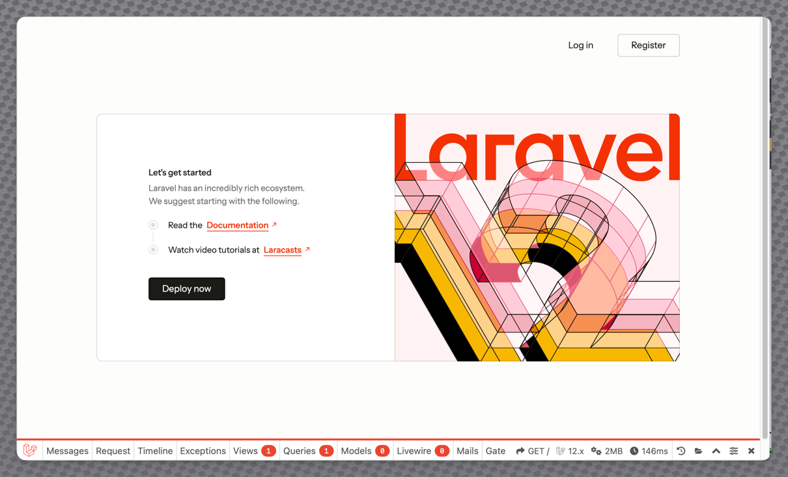
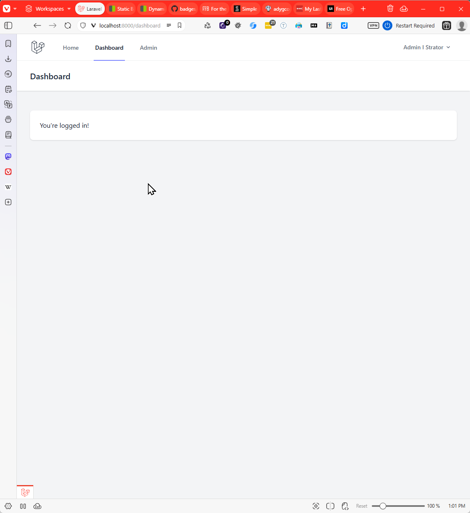
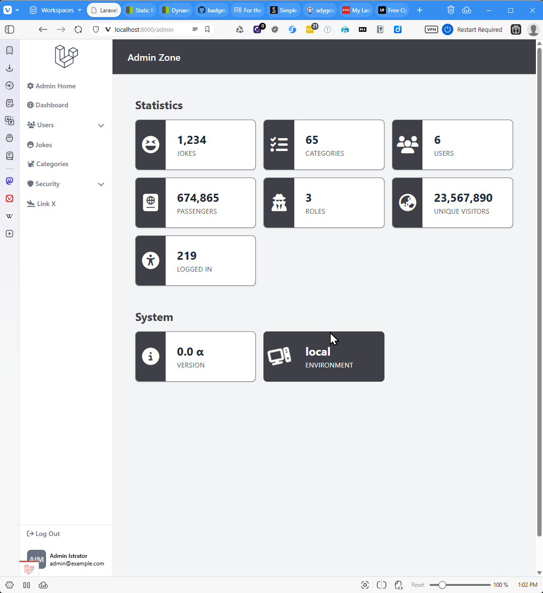

# Laravel Base Blade Kit (BBK)
<a name="top" id="top" ></a>


A Laravel Blade Template with Sanctum Authentication built in.

*Based on the Blade & Breeze Starter Kit provided with Laravel versions before Laravel 12.*

### Built With

[![PHP][Php.com]][Php-url]
[![Laravel][Laravel.com]][Laravel-url]
[![Tailwindcss][Tailwindcss.com]][Tailwindcss-url]
[![Livewire][Livewire.com]][Livewire-url]
[![Inertia][Inertia.com]][Inertia-url]

### Editor of choice

[![PhpStorm][PhpStorm.com]][PhpStorm-url] 
[![JetBrains][JetBrains.com]][JetBrains-url]


<p align="right">(<a href="#top">back to top</a>)</p>


## Description

A starter kit for Laravel based on Laravel's Blade templating engine, TailwindCSS v4, HyperUI components and FontAwesome Free icons.

It contains three sections:

- Static Layout, Controller and Pages
- Authenticated User Layout and Pages
- Administration Layout, Controller and Pages

The project was developed as a re-write of the "Retro Blade Kit" also by Adrian Gould.

It provides a base template for the creation of a "SaaS" style application, omitting sections that may tie to a specific vendor such as a payment system. 

#### General Welcome/Home Page



#### Authenticated User Dashboard



#### Admin Dashboard




<p align="right">(<a href="#top">back to top</a>)</p>


## Table of Contents

- [Description](#description)
- [Installation](#installation)
- [Credits](#credits)
- [Licence](#licence)
- [Badges](#badges)
- [Tests](#tests)
- [Contact](#contact)

## Installation

Remember to run `composer install` and `artisan migrate` to make sure all tables are created, and packages correctly installed.

### Via Laravel Herd

One-click install a new application using this starter kit through [Laravel Herd](https://herd.laravel.com):

<a href="https://herd.laravel.com/new?starter-kit=adygcode/base-blade-kit"></a>

### Via the Laravel Installer

Create a new Laravel application using this starter kit through the official [Laravel Installer](https://laravel.com/docs/12.x/installation#installing-php):

```bash
  laravel new my-app --using=adygcode/base-blade-kit
```

Replace `my-app` with the name of your project, using kebab-case.


<p align="right">(<a href="#top">back to top</a>)</p>


## Credits

This template is built using:

- Font Awesome. (n.d.). Fontawesome.com. https://fontawesome.com
- Laravel - The PHP Framework For Web Artisans. (2011). Laravel.com. https://laravel.com
- Laravel Bootcamp - Learn the PHP Framework for Web Artisans. (n.d.). Bootcamp.laravel.com. https://bootcamp.laravel.com/
- PHP: Hypertext Preprocessor. (n.d.). Www.php.net. https://php.net
- Professional README Guide. (n.d.). Coding-Boot-Camp.github.io. Retrieved April 15, 2024, from https://coding-boot-camp.github.io/full-stack/github/professional-guide
- TailwindCSS. (2023). Tailwind CSS - Rapidly build modern websites without ever leaving your HTML. Tailwindcss.com. https://tailwindcss.com/
- Free Open Source Tailwind CSS v4 Components | HyperUI. (2025). HyperUI. https://www.hyperui.dev/


<p align="right">(<a href="#top">back to top</a>)</p>


## Badges

[![Forks][forks-shield]][forks-url]
[![Issues][issues-shield]][issues-url]
[![Educational Community Licence][licence-shield]][licence-url]


<p align="right">(<a href="#top">back to top</a>)</p>


## Tests

TBD


<p align="right">(<a href="#top">back to top</a>)</p>


## Contact

Adrian Gould: Lecturer (ASL1), [North Metropolitan TAFE](https://northmetrotafe.wa.edu.au), Perth WA
- GitHub Pages: [https://adygcode.github.io](https://adygcode.github.io)
- GitHub Repos: [https://github.com/AdyGCode](https://github.com/AdyGCode)
- Starter Kit Repo: [Retro Blade Starter Kit](https://github.com/AdyGCode/retro-blade-kit)

<p align="right">(<a href="#top">back to top</a>)</p>


## Licence

The Laravel "Base Blade Kit" Starter Kit is open-sourced software licensed under the MIT license.


<p align="right">(<a href="#top">back to top</a>)</p>


---


[forks-shield]: http://img.shields.io/github/forks/adygcode/base-blade-kit.svg?style=for-the-badge

[forks-url]: https://github.com/AdyGCode/base-blade-kit/network/members

[issues-shield]: http://img.shields.io/github/issues/adygcode/base-blade-kit.svg?style=for-the-badge

[issues-url]: https://github.com/adygcode/base-blade-kit/issues

[licence-shield]: https://img.shields.io/github/license/adygcode/base-blade-kit.svg?style=for-the-badge

[licence-url]: https://github.com/adygcode/base-blade-kit/blob/main/License.md

[product-screenshot]: _docs/images/screenshot.png

[Laravel.com]: https://img.shields.io/badge/Laravel-FF2D20?style=for-the-badge&logo=laravel&logoColor=white

[Laravel-url]: https://laravel.com

[Tailwindcss.com]: https://img.shields.io/badge/Tailwindcss-06B6D4?style=for-the-badge&logo=tailwindcss&logoColor=white

[Tailwindcss-url]: https://tailwindcss.com

[Livewire.com]: https://img.shields.io/badge/Livewire-4E56A6?style=for-the-badge&logo=livewire&logoColor=white

[Livewire-url]: https://livewire.laravel.com

[Inertia.com]: https://img.shields.io/badge/Inertia-9553E9?style=for-the-badge&logo=inertia&logoColor=white

[Inertia-url]: https://inertiajs.com

[Php.com]: https://img.shields.io/badge/Php-777BB4?style=for-the-badge&logo=php&logoColor=white

[Php-url]: https://inertiajs.com

[JetBrains.com]: https://img.shields.io/badge/JetBrains-000000?style=for-the-badge&logo=jetbrains&logoColor=white

[JetBrains-url]: https://jetbrains.com

[PhpStorm.com]: https://img.shields.io/badge/phpstorm-000000?style=for-the-badge&logo=phpstorm&logoColor=white

[PhpStorm-url]: https://www.jetbrains.com/phpstorm/
